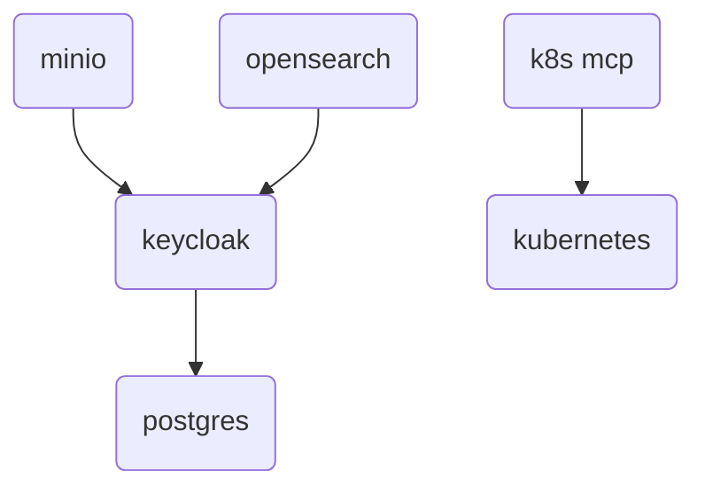

<!-- TODO: Rajouter l'histoire du .env pour templatiser les déploiements  -->
<!-- TODO: Rajouter Kube dashboard dans le kubernetes -->
# Deployment factory for Fred

The `deployment-factory` repository provides the Docker Compose based deployment setup for the `fred-agent` projects ecosystem. It serves as a centralized environment to orchestrate and run the common infrastructure services required by the other `fred-agent` projects.

This project helps to deploy the following support services:
- **Keycloak** – for authentication and identity management
- **MinIO** – for object storage
- **OpenSearch** – for search and analytics capabilities (including vector store capabilities)
- **k3d** - for setting up a dummy kubernetes cluster (used by Fred project only for development purposes)
- **Kubernetes MCP Server** - so that AI agents can interact with Kubernetes clusters

This repository aims to simplify local development and testing by providing a ready-to-use, reproducible environment for all shared dependencies across the `fred-agent` projects.

## Requirements

All these docker-compose files share the same network called `fred-shared-network`. So first, create the shared network with the following command line.

```
docker network create fred-shared-network --driver bridge
```

**Note** : If the browser used to access Fred's frontend is on the same machine as the one where Keycloak is hosted as a container, please add the entry `127.0.0.1 app-keycloak` into your docker host `/etc/hosts` so that your web browser can reach Keycloak instance for authentication:

```sh
grep -q '127.0.0.1.*app-keycloak' /etc/hosts || echo "127.0.0.1 app-keycloak" | sudo tee -a /etc/hosts
```

## Configuration 

Please create a ``.env`` file in the ``docker-compose`` to customize your deployment by copying and adapting the ``docker-compose/.env.sample`` file: 


```bash
cp docker-compose/.env.sample docker-compose/.env
```

Here are **examples** of custom deployment params you can modify:
- ``DOCKER_COMPOSE_HOST_FQDN``
- ``POSTGRES_ADMIN_PASSWORD``
- ``MINIO_ROOT_USER``
- ``MINIO_ROOT_PASSWORD``
- ``OPENSEARCH_ADMIN_PASSWORD``

## Deployment


All these services can be started separately.

Keycloak is already configured with some clients, roles and users.

Minio and Opensearch are already configured to be connected to Keycloak. This is a graph to show the dependencies between compose files:



Launch the components according to your needs with these command lines:

- Keycloak
```
docker compose -f docker-compose/docker-compose-keycloak.yml -p keycloak up -d
```

<!-- TODO: Need to check how we can specify hard dependency between Keycloak and depending services (MinIO & Opensearch) -->

- MinIO
```
docker compose -f docker-compose/docker-compose-minio.yml -p minio up -d
```

- OpenSearch
```
docker compose -f docker-compose/docker-compose-opensearch.yml -p opensearch up -d
```

- Lightweight Kubernetes distribution (k3d)
```
docker compose -f docker-compose/docker-compose-kubernetes.yml -p kubernetes up -d
```

- Kubernetes MCP Server
```
docker compose -f docker-compose/docker-compose-k8s-mcp.yml -p k8s-mcp up -d
```

## Access the service interfaces

> :key: For development purposes, the password for nominative or service accounts is `Azerty123_`

Hereunder these are _the nominative SSO accounts_ registered into the Keycloak realm and their roles:

  - ``alice`` (role: ``admin``)
  - ``bob`` (roles: ``editor``, ``viewer``)
  - ``phil`` (role: ``viewer``)

Hereunder, these are the information to connect to each service with their _local service accounts_.

### Keycloak

- URL: http://$(DOCKER_COMPOSE_HOST_FQDN):8080
- Service accounts:
  - `admin`
- Realm: `app`

### MinIO:

- URLs:
  - http://$(DOCKER_COMPOSE_HOST_FQDN):9001 (web)
  - http://$(DOCKER_COMPOSE_HOST_FQDN):9000 (service)
- Service accounts:
  - `admin` (admin)
  - `app_ro` (read-only)
  - `app_rw` (read-write)
 - Buckets:
   - `app-content`
   - `app-feedback`

### OpenSearch

- URLs:
  - http://$(DOCKER_COMPOSE_HOST_FQDN):5601 (dashboard)
  - https://$(DOCKER_COMPOSE_HOST_FQDN):9200 (service)
- Service accounts:
  - `admin` (admin)
  - `app_ro` (read-only)
  - `app_rw` (read-write)
 - Indexes:
   - `metadata-index`
   - `vector-index`
   - `active-sessions-index`
   - `chat-interactions-index`
