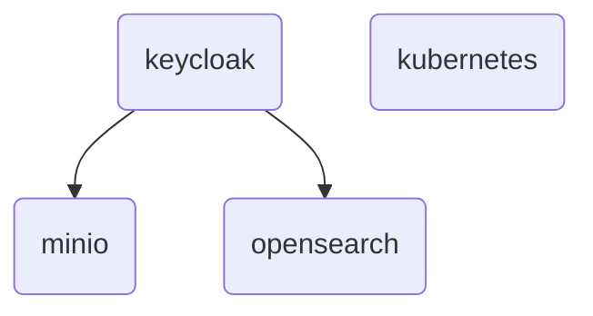

<!-- TODO: Rajouter l'histoire du .env pour templatiser les déploiements  -->
<!-- TODO: Rajouter Kube dashboard dans le kubernetes -->
# Deployment factory for Fred

The `deployment-factory` repository provides the Docker compose based deployment setup for the `fred-agent` projects ecosystem. It serves as a centralized environment to orchestrate and run the common infrastructure services required by the other `fred-agent` projects.

These services provides:
- **Keycloak** – for authentication and identity management
- **MinIO** – for object storage
- **OpenSearch** – for search and analytics capabilities
- **k3d** - for setting up a dummy kubernetes cluster (used by fred project only for development purposes)

This repository aims to simplify local development and testing by providing a ready-to-use, reproducible environment for all shared dependencies across the `fred-agent` projects.

## Requirements

All these docker-compose files share the same network called `fred-shared-network`. So first, create the shared network with the following command line.

```
docker network create fred-shared-network --driver bridge
```

And add the entry `127.0.0.1 app-keycloak` into your docker host `/etc/hosts` to be correctly redirected from your web browser.

```sh
grep -q '127.0.0.1.*app-keycloak' /etc/hosts || echo "127.0.0.1 app-keycloak" | sudo tee -a /etc/hosts
```

## Deployment

All these services can be started separetaly.

Keycloak is already configured with some clients, roles and users.  

Minio and Opensearch are already configured to be connected to keycloak. This is a graph to show the dependancies between compose files:



Launch the components according to your needs with these command lines:

- Keycloak
```
docker compose -f docker-compose-keycloak.yml up -d
```

- MinIO
```
docker compose -f docker-compose-minio.yml up -d
```

- OpenSearch
```
docker compose -f docker-compose-opensearch.yml up -d
```

- k3d
```
docker compose -f docker-compose-kubernetes.yml up -d
```

## Access the service interfaces

> :key: For development purposes, the password for nominative or service accounts is `Azerty123_`

Hereunder these are _the nominative SSO accounts_ registered into the Keycloak realm and their roles:

  - alice (role: admin)
  - bob (roles: editor, viewer)
  - phil (role: viewer)

Hereunder, these are the information to connect to each service with their _local service accounts_.

### Keycloak

- URL: http://localhost:8080
- Service accounts:
  - `admin`
- Realm: `app`

### MinIO:

- URLs:
  - http://localhost:9001 (web)
  - http://localhost:9000 (service)
- Service accounts:
  - `admin` (admin)
  - `app_ro` (read-only)
  - `app_rw` (read-write)
 - Buckets:
   - `app-content`
   - `app-feedback`

### OpenSearch

- URLs:
  - http://localhost:5601 (dashboard)
  - https://localhost:9200 (service)
- Service accounts:
  - `admin` (admin)
  - `app_ro` (read-only)
  - `app_rw` (read-write)
 - Indexes:
   - `metadata-index`
   - `vector-index`
   - `active-sessions-index`
   - `chat-interactions-index`
